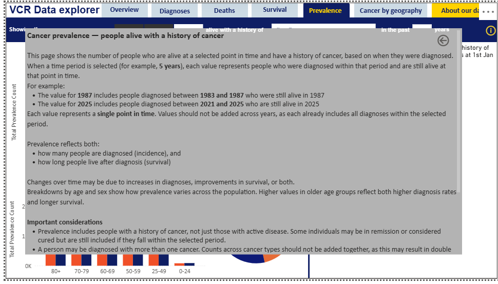

# 📈 Cancer Prevalence Dashboard (Victorian Cancer Registry)

## 🔍 Overview

This project involved designing and developing the **Cancer Prevalence tab from scratch** for the Cancer Council Victoria Data Explorer using real-world data from the Victorian Cancer Registry (VCR).

The dashboard provides a **public-facing, interactive tool** that enables clinicians, researchers, policymakers, and the general public to explore cancer prevalence trends in a clear and accessible way.

---

## 🎯 Project Objective

* Analyse cancer prevalence trends over time
* Compare demographic and regional differences
* Deliver an intuitive, user-friendly dashboard
* Ensure compliance with healthcare data governance standards

---

## 📊 Understanding the Dashboard

The dashboard focuses on analysing the **number of people living with cancer (prevalence)** for all malignant tumours.

It is configured to display:

* **Measure:** Number (total count of cases)
* **Population:** Males and females
* **Prevalence window:** People diagnosed in the past 5 years

### 🧠 What is Cancer Prevalence?

Cancer prevalence refers to the **number of people who are still alive and have been diagnosed with cancer within a specified time period**.

For example:

* 5-year prevalence = people alive today diagnosed in the past 5 years
* 10-year prevalence = people alive today diagnosed in the past 10 years

Prevalence captures both:

* New diagnoses (incidence)
* Survival over time

---

### 🔄 Number vs Rate

* **Number** represents the total number of cases
* **Rate (per 100,000 population)** allows fair comparison across groups

Rates are used to compare:

* Regions (metro vs regional)
* Socio-economic groups
* Population groups (e.g. Aboriginal vs non-Aboriginal)

This ensures comparisons are **standardised and not biased by population size**.

---

## 📊 Dashboard Walkthrough

### 1. Prevalence Trend Over Time

Shows a consistent increase in cancer prevalence over time for both males and females. This reflects improved survival rates alongside ongoing diagnoses.

---

### 2. Age Group Distribution

Highlights that cancer prevalence is significantly higher in older populations (70+), indicating a greater long-term disease burden.

---

### 3. Cancer Type Comparison

Compares prevalence across cancer types, helping identify which cancers contribute most to overall burden.

---

### 4. Interactive Features

Custom tooltips and information panels improve usability by providing additional context without cluttering the dashboard.

---

## 📊 Key Insights

* Cancer prevalence has increased consistently over time, reflecting improved survival and continued incidence

* Males show higher prevalence than females, both in total cases and per 100,000 population

* Older age groups (70+) carry the highest burden of cancer prevalence

* Major cities show higher prevalence compared to regional areas, reflecting population concentration and better access to healthcare

* Socio-economic patterns suggest higher prevalence in less disadvantaged groups, likely due to improved survival and access to care

* Lower observed prevalence in some population groups may indicate disparities in diagnosis and healthcare access rather than lower disease burden

---

## 💡 Business Value

* Supports data-driven healthcare planning and resource allocation
* Identifies high-risk demographic and geographic groups
* Highlights inequalities in healthcare access and outcomes
* Improves accessibility of complex public health data for non-technical users

---

## ⚙️ Technical Approach

* **Tool:** Microsoft Power BI
* **Data Processing:** R and Excel
* **Data Modelling:** Measures, relationships, and calculated fields
* **Design:** Interactive visuals, slicers, and custom tooltips
* **Governance:** Small-cell suppression and rounding for privacy compliance

---

## 🚀 Conclusion

This project demonstrates the ability to transform complex healthcare data into a **clear, interactive, and insight-driven dashboard**, supporting real-world decision-making in public health.

---

## 🔗 Links

👉 [View Portfolio Case Study](https://github.com/manavnursmooloo23-maker/portfolio-proj)
