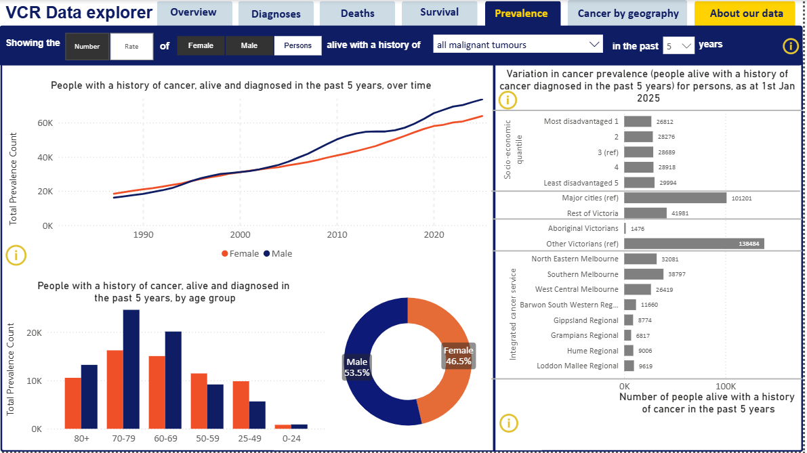
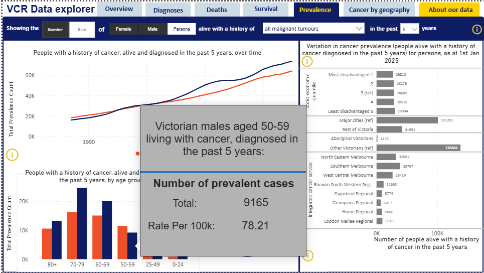
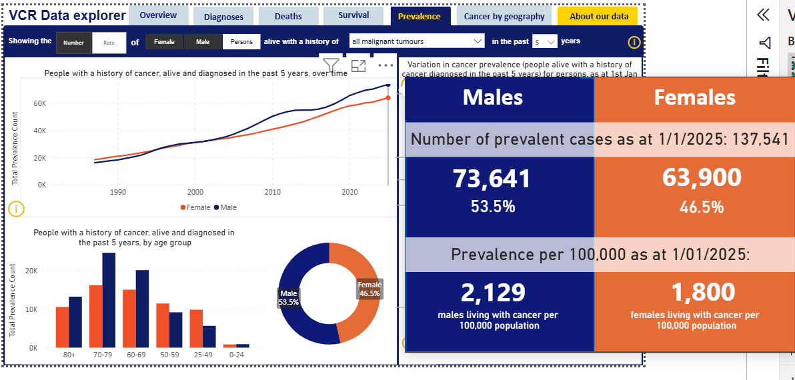

# 📈 Cancer Prevalence Dashboard (Victorian Cancer Registry)

## 🔍 Overview

This project involved designing and developing the **Cancer Prevalence tab** for the Cancer Council Victoria Data Explorer using real-world data from the Victorian Cancer Registry (VCR).

The dashboard provides a **public-facing, interactive tool** that enables clinicians, researchers, policymakers, and the general public to explore cancer prevalence trends in a clear and accessible way.

---

## 📊 Data Description

The dashboard is built using cancer prevalence data from the Victorian Cancer Registry (VCR), structured across multiple datasets to capture demographic, clinical, and geographic dimensions.

The data includes:

* **Timepoints** – Year-based snapshots representing prevalence at a specific point in time
* **Prevalence window (LastXYears)** – Defines the time horizon, representing people diagnosed within that period who are still alive
* **Sex** – Male, Female, and Persons
* **Age groups** – (e.g. 0–24, 25–49, 50–69, 70–79, 80+)
* **Cancer types** – Grouped into main, sub, and detailed tumour classifications
* **Geographical and socio-economic groupings** – Including remoteness, SEIFA, and Integrated Cancer Services (ICS) regions

---

## 📊 Key Dataset Labels

### 🟨 Core Time Variables

* **TimePoints** – Year of data snapshot
* **LastXYears** – Prevalence window (e.g. 1, 5, 10, 20 years)

### 🟩 Demographic Variables

* **Sex** – Male, Female, Persons
* **timepoint_ageg** – Age group classification

### 🟦 Cancer Classification

* **TUMOUR_GROUP_ID** – Unique cancer identifier
* **tumourgroup_main** – Main category (e.g. breast, lung)
* **tumourgroup_sub** – Sub-category
* **tumourgroup_detail** – Detailed classification

### 🟪 Prevalence Measures

* **Total_Prevalence** – Number of people living with cancer
* **Perc_of_Vic_pop_within_age_group** – Percentage within age group

### 🟫 Disparity Variables

* **SEIFA** – Socio-economic grouping
* **Remoteness / Region** – Geographic classification
* **Integrated Cancer Services (ICS)** – Health service regions

---

## 📊 Dashboard Walkthrough

### 1. What We Are Looking At

The dashboard presents a high-level view of cancer prevalence in Victoria. In this view, we are analysing the number of people living with cancer (prevalence) for:

* All malignant tumours (default selection)
* Both males and females
* People diagnosed within the past 5 years (5-year prevalence)

This provides an immediate understanding of the scale of cancer prevalence in the population.

---

### 2. Interpreting the Data Through the Dashboard

#### (i) Subgroup Insight Using Hover Interaction

The dashboard’s hover functionality allows users to drill down into specific subgroups for deeper analysis.

For example, when hovering over **Victorian males aged 50–59 diagnosed in the past 5 years**, the dashboard reveals:

* **Total cases:** 9,165
* **Rate per 100,000:** 78.21

This demonstrates how users can move beyond aggregated views and explore **granular, subgroup-level insights**.

The combination of:

* **Absolute numbers** (total cases)
* **Population-adjusted rates**

enables more meaningful interpretation. While the number highlights the **scale of cases**, the rate allows fair comparison across different population groups.

This shows that cancer prevalence is not limited to older age groups, with **middle-aged populations also contributing significantly to overall disease burden**.

---

#### (ii) Gender-Based Trend and Comparison

The dashboard provides a clear comparison of cancer prevalence between males and females, both over time and in total.

From the summary:

* **Males:** 73,641 cases (53.5%)
* **Females:** 63,900 cases (46.5%)

When adjusted for population size:

* **Males:** 2,129 per 100,000
* **Females:** 1,800 per 100,000

This indicates that males experience a **higher cancer prevalence both in total cases and when standardised for population size**.

The higher rate confirms that this difference is not driven solely by population size, but reflects a **genuine variation in prevalence between genders**.

Additionally, the trend over time shows a steady increase for both groups, reflecting the combined effect of:

* Improved survival rates
* Continued incidence of new cancer cases

This demonstrates how the dashboard supports comparison across both **overall scale (number)** and **relative burden (rate)**, enabling more informed analysis.

---

#### (iii) Socio-economic and Geographic Variation

From the socio-economic breakdown:

* Prevalence increases from **most disadvantaged** to **least disadvantaged groups**

This suggests that higher prevalence may be associated with:

* Better access to healthcare
* Earlier detection
* Improved survival rates

Across geography:

* **Major cities** show significantly higher prevalence compared to regional areas
* Variation is also visible across different Integrated Cancer Service (ICS) regions

Additionally, differences between population groups are observed, such as:

* Lower recorded prevalence for **Aboriginal Victorians** compared to other populations

However, this does not necessarily indicate a lower cancer burden. Instead, it may reflect:

* Differences in access to healthcare
* Variations in diagnosis rates
* Inequalities in survival outcomes

This highlights the importance of interpreting prevalence data carefully, as it reflects both **disease occurrence and survival**, and can reveal underlying disparities in healthcare access and outcomes.

---

## 💡 Business Value

* Supports data-driven healthcare planning and resource allocation
* Identifies high-risk demographic and geographic groups
* Highlights inequalities in healthcare access and outcomes
* Improves accessibility of complex public health data for non-technical users

---

## ⚙️ Technical Approach

- **Power BI**: Built the dashboard and interactive visuals  

- **Data Processing (R & Excel)**: Cleaned and prepared data before loading into Power BI  

- **Data Modelling**: Created DAX measures and managed relationships to ensure accurate calculations  

- **Design**: Developed charts, slicers, and custom tooltips for user interaction  

- **Validation**: Cross-checked outputs to ensure consistency and correctness  

- **Governance**: Applied small-cell suppression and rounding to maintain data privacy  
---

## 🚀 Conclusion

This project demonstrates the ability to transform complex healthcare data into a **clear, interactive, and insight-driven dashboard**, supporting real-world decision-making in public health.

---

## 🔗 Links

👉 [View Case Study](https://github.com/manavnursmooloo23-maker/portfolio-proj/blob/main/projects/cancer-dashboard.md)
